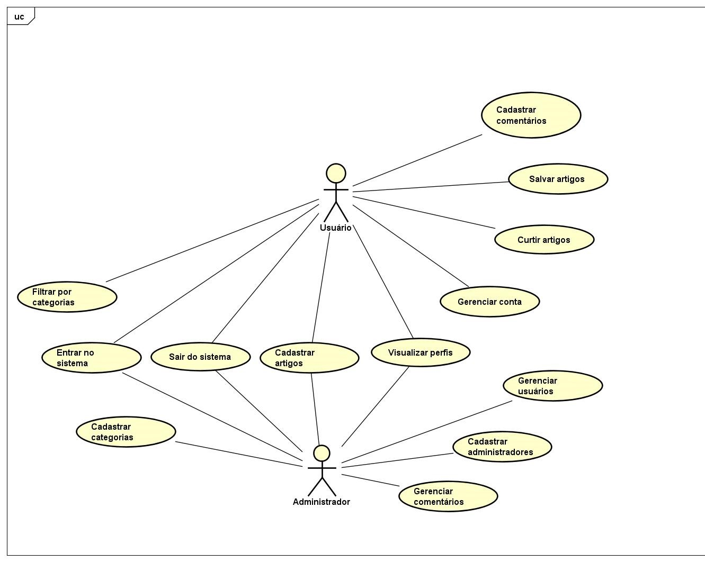

# Modelo de Casos de Uso

## 1. Diagrama de Casos de Uso

## 2. Listagem dos detalhamentos dos casos de uso

1. [CDU-001](details/F01_cadastrar_se.md)
2. [CDU-002](details/F02_entrar_no_sistema.md)
3. [CDU-003](details/F03_sair_do_sistema.md)
4. [CDU-004](details/F04_gerenciar_conta.md)
5. [CDU-005](details/F05_gerenciar_usuario.md)
6. [CDU-006](details/F06_visualizar_perfil.md)
7. [CDU-007](details/F07_cadastrar_artigo.md)
8. [CDU-008](details/F08_cadastrar_area.md)
9. [CDU-009](details/F09_cadastrar_subarea.md)
10. [CDU-010](details/F10_cadastrar_comentario.md)
11. [CDU-011](details/F11_buscar_artigo.md)
12. [CDU-012](details/F12_filtrar_por_area.md)
13. [CDU-013](details/F13_salvar_artigo.md)
14. [CDU-014](details/F14_curtir_artigo.md)
15. [CDU-015](details/F15_visualizar_salvos.md)
16. [CDU-016](details/F16_cadastrar_administrador.md)
17. [CDU-017](details/F17_mudar_senha.md)
